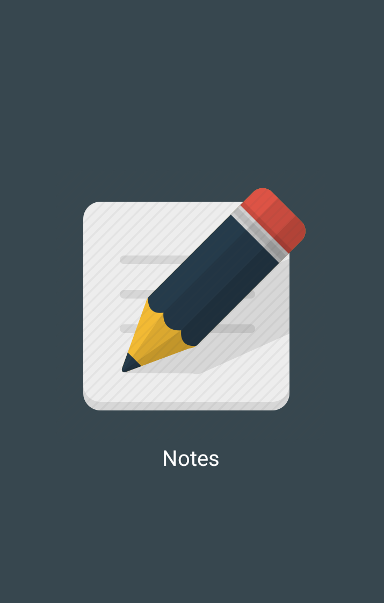
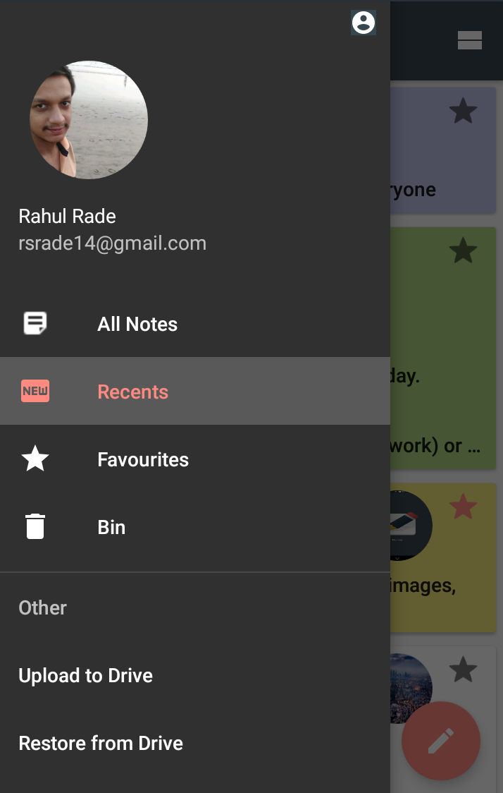
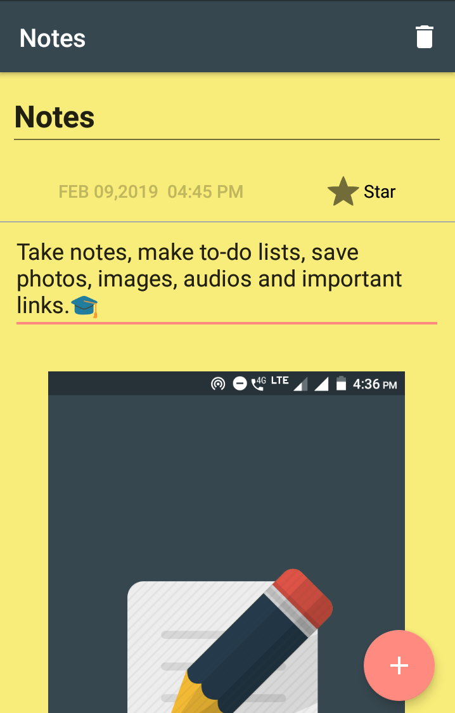

# Notes

Notes is an android app to take notes, make to-do lists, save important photos, images and audios.

### Features -
- Add photos, images and audios
- Mark a note as favourite
- Search notes by title
- Take a backup of notes on Google Drive
- Export notes
- Restore deleted notes

### Images - 

|   |  |
|:----:|:----:|
|  |  |
|  |  |

### Thank You!
